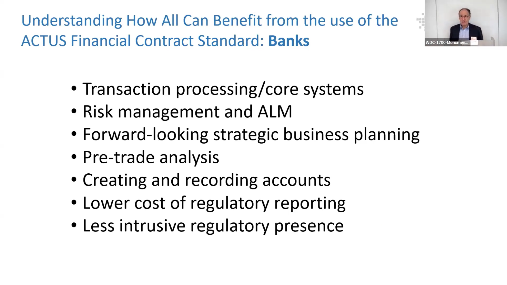
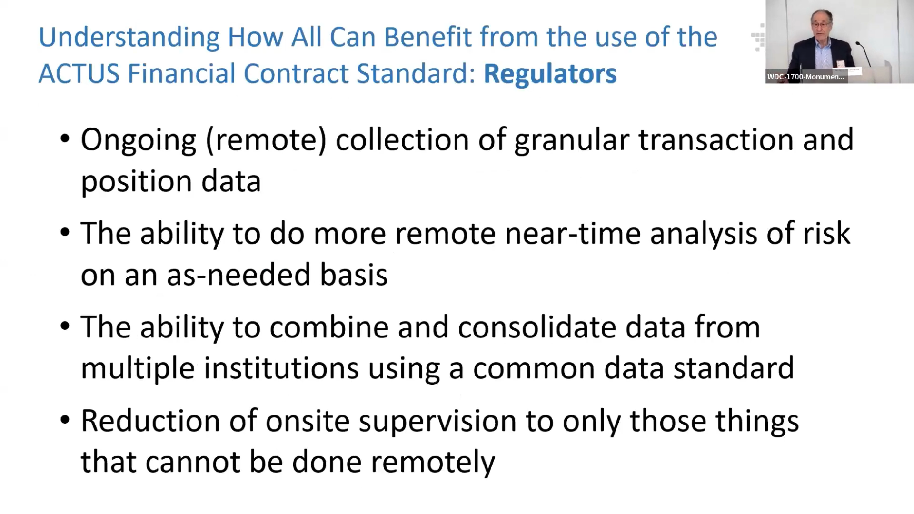

# Benefits of ACTUS

    <iframe width="896" height="504" src="https://youtube.com/embed/DGbhhUmrwWU?start=641" frameborder="0" allow="accelerometer; autoplay; clipboard-write; encrypted-media; gyroscope; picture-in-picture" allowfullscreen></iframe>

## Key Advantages of the ACTUS Standard

1. **Improved Efficiency:** Standardizes financial contracts, reducing inefficiencies and costs, and speeding up operations.

2. **Enhanced Risk Management:** Provides a consistent framework for accurate risk modeling and mitigation.

3. **Better Regulatory Compliance:** Facilitates standardized, accurate data reporting, improving transparency and compliance.

4. **Versatility Across Sectors:** Applicable to various financial environments, including legacy systems and DeFi platforms.

5. **Consistent Data Representation:** Ensures uniform representation of financial contracts, reducing data inconsistencies.

6. **Automation Capabilities:** Supports automated processing of contracts, enhancing efficiency and reducing errors.

7. **Transformative Impact:** Brings clarity and consistency to financial contracts, significantly improving data management and analysis.

## For Banks

1. **Transaction Processing:** Enhances core systems for more efficient processing of transactions.

2. **Risk Management:** Improves risk management and Asset Liability Management (ALM) through standardized modeling.

3. **Strategic Planning:** Supports forward-looking strategic business planning with consistent data.

4. **Regulatory Reporting:** Reduces the cost and complexity of regulatory reporting by providing standardized data.

## For Regulators

1. **Data Collection:** Enables ongoing remote collection of detailed transaction and position data.

2. **Risk Analysis:** Facilitates near-time risk analysis as needed, improving oversight.

3. **Data Standardization:** Allows integration and consolidation of data from multiple institutions using a common standard.

4. **Supervision:** Reduces the need for onsite supervision by enabling effective remote oversight.
