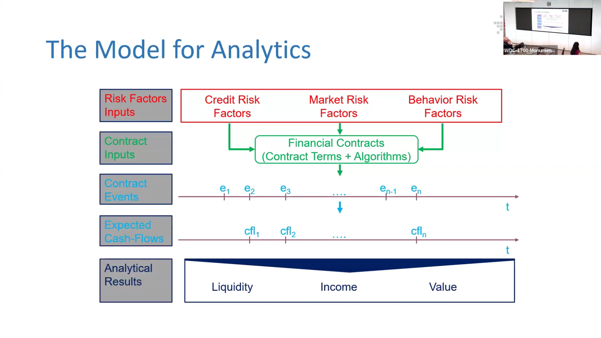

# The Enhanced Model for Analytics

This enhanced model provides a step-by-step approach to understanding financial contracts. Starting with risk factors and contract details, it tracks the flow of events and expected cash flows, ultimately leading to analytical results. These results help financial institutions manage risks, predict outcomes, and make informed decisions in a complex financial environment.

    <iframe width="896" height="504" src="https://youtube.com/embed/DGbhhUmrwWU?start=538" frameborder="0" allow="accelerometer; autoplay; clipboard-write; encrypted-media; gyroscope; picture-in-picture" allowfullscreen></iframe>

The model offers a comprehensive framework for analyzing financial contracts. It explains how various inputs and events lead to expected cash flows and ultimately affect key financial outcomes like liquidity, income, and value.

## 1. Risk Factors Inputs

These are the initial inputs that influence the various risk categories impacting the financial contract:

- **Economic Data**: Market conditions and economic indicators.
- **Credit Scores**: Assessments of creditworthiness.
- **Market Volatility**: Fluctuations in the market affecting investments.
- **Behavioral Patterns**: Actions of borrowers or investors, such as early repayment.

These inputs are essential for assessing the risk level of a financial contract.

## 2. Risk Factors

These are the risks that directly affect the financial contract:

- **Credit Risk Factors**: The likelihood of a borrower defaulting on payments.
- **Market Risk Factors**: Risks related to changes in interest rates, stock prices, or currency values.
- **Behavior Risk Factors**: Risks arising from unpredictable human behaviors, such as defaulting or early loan repayment.

## 3. Contract Inputs

These inputs consist of the specific details of the financial contract:

- **Principal Amount**: The amount of money borrowed or invested.
- **Interest Rates**: The cost of borrowing or return on investment.
- **Payment Schedules**: Timelines for repayments or returns.
- **Terms and Conditions**: Additional details governing the contract.

These details define how the contract will behave under various risk scenarios.

## 4. Contract Events

These are key events that happen throughout the contract's duration:

- **Scheduled Events**: Regular occurrences such as monthly payments.
- **Unexpected Events**: Events like defaults or contract amendments.
- **Decisions**: Actions taken by the parties involved that affect the contract’s course.

The timing and occurrence of these events are critical for understanding the contract’s performance.

## 5. Expected Cash Flows

As events happen, they generate cash flows:

- **Inflows**: Money coming into the contract, such as payments received.
- **Outflows**: Money leaving the contract, such as payments made.

These expected cash flows are modeled based on the contract inputs and the influencing risk factors, determining whether the contract is on track or facing issues.

## 6. Analytical Results

The final analysis focuses on three main outcomes:

- **Liquidity**: The contract’s ability to generate cash quickly to meet short-term needs.
- **Income**: The earnings derived from the contract, such as interest.
- **Value**: The overall worth of the contract after considering all cash flows and risks.

These results are crucial for understanding the financial health of the contract and guiding decision-making for institutions, investors, and regulators.

## ACTUS in Financial Analytics

By using ACTUS, institutions can improve the accuracy and reliability of their financial analytics, leading to better decision-making and risk management.
