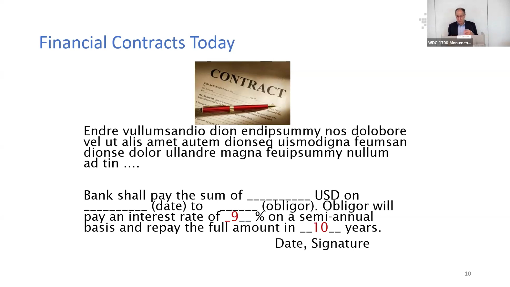
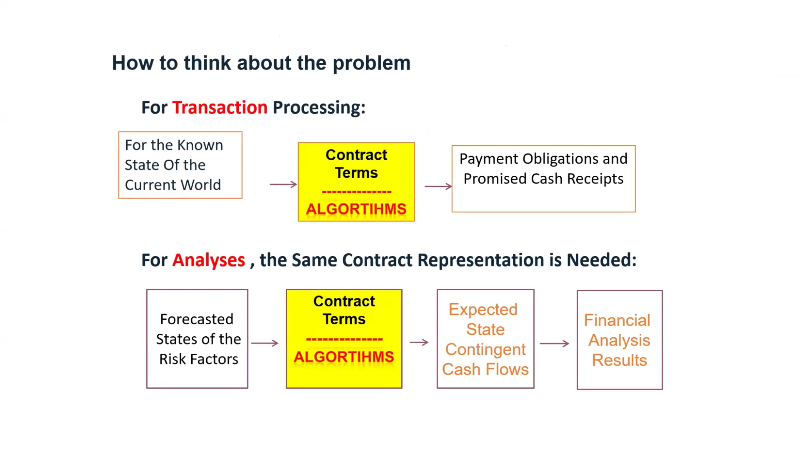

# Contracts and Systems

## Today's Financial Contracts

    <iframe width="896" height="504" src="https://youtube.com/embed/DGbhhUmrwWU?start=324" frameborder="0" allow="accelerometer; autoplay; clipboard-write; encrypted-media; gyroscope; picture-in-picture" allowfullscreen></iframe>

## Centrality of Financial Contracts

Financial contracts are the backbone of modern financial systems. They facilitate the exchange of goods and services, and play a pivotal role in all financial activities as they outline the obligations, rights, and cash flows essential for managing transactions and operations. Without a standardized approach to these contracts, institutions risk encountering inefficiencies and increased operational risks.

### Underlying Insights at the Heart of the ACTUS Standard

#### Financial Contracts

Financial contracts are agreements that involve the exchange of promised payments. Although these contracts are initially written in natural language, they are converted into algorithms to compute payment obligations.

#### Algorithm Representation

A single algorithm can represent various types of financial contracts, including annuities and mortgages. This highlights the versatility and efficiency of algorithmic representation in financial computations.

#### Cash Flow Patterns

Despite the wide range of financial products, they generally use a limited number of cash flow patterns. Most payment obligations can be represented by fewer than three dozen algorithms, underscoring the commonality in financial contract structures.

## How to think about financial systems

    <iframe width="896" height="504" src="https://youtube.com/embed/DGbhhUmrwWU?start=399" frameborder="0" allow="accelerometer; autoplay; clipboard-write; encrypted-media; gyroscope; picture-in-picture" allowfullscreen></iframe>

### Transaction Processing

In today's financial systems, contract terms are processed by algorithms to determine the promised cash receipts. This algorithmic processing ensures accurate and efficient handling of financial transactions.

### Financial Analysis

Risk factors are forecasted, and contract terms are processed by algorithms to generate expected state-contingent cash flows. This process leads to comprehensive financial analysis results, providing insights into potential financial outcomes under various scenarios.
