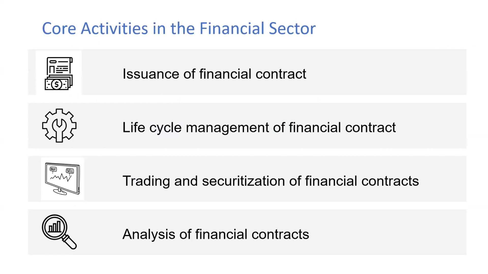

# Core Activities in the Financial Sector

## Financial Contracts in the Financial Sector

In the financial sector, core activities revolve around financial contracts. These contracts include:

Watch video – [YouTube](https://youtu.be/DGbhhUmrwWU?si=V1ibiBrYBs8UH36&t=130s)

- **Issuance:** Creating and issuing new financial contracts like loans, bonds, and derivatives.
- **Lifecycle Management:** Managing contracts throughout their lifecycle, including payments, adjustments, and renewals.
- **Trading:** Buying and selling financial contracts on various markets.
- **Securitization:** Packaging financial contracts into securities that can be traded or sold.
- **Analytics:** Analyzing financial contracts to assess risk, profitability, and compliance.
