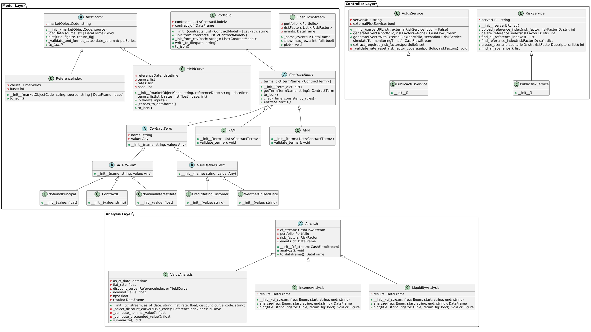

# Architecture

The **Awesome ACTUS Library** is built on a clear design principle:  
➡️ **Make ACTUS-compliant contract modeling intuitive, extensible, and user-friendly.**

To achieve this, the library adopts a **Model-View-Controller (MVC)** design pattern — applied to a financial modeling context.

---

## 🧠 Design Pattern: Model-View-Controller (MVC)

---

### 🧩 Model — Contract Definitions & Financial Data Structures

This layer represents the **core ACTUS domain** and acts as both the input and output interface of the library.

It includes:

- ✅ **ACTUS Contract Types (CTs)**  
  Defined through classes like `PAM`, `ANN`, each of which inherits from the abstract `ContractModel`. Each contract holds a list of `ContractTerm` objects representing individual data fields (e.g., `NotionalPrincipal`, `MaturityDate`, etc.).

- ✅ **Risk Factors**  
  Modeled as time-value series. All risk factors inherit from the abstract class `RiskFactor`, with concrete implementations such as:
  - `ReferenceIndex`
  - `YieldCurve`

- ✅ **Simulation Output: `CashFlowStream`**  
  Encapsulates the cash flow events returned from the simulation engine. Provides a tabular representation of results and file I/O utilities.

- ✅ **Portfolio**  
  A structured collection of contract instances (`ContractModel`), allowing grouped simulation and aggregation.

> The model layer prepares the **inputs for the controller**, and **structures the outputs** received back from the simulation engine.

It is:
- 💡 Declarative
- 📦 Serializable (e.g., to JSON)
- 🧪 Testable without backend services

---

### 🛠️ Controller — Backend Service Interfaces

This layer orchestrates the interaction with external ACTUS-compliant computation engines:

- `ActusService`: Manages contract simulation requests and returns `CashFlowStream` results. Supports both local (e.g., Docker) and remote servers.
- `RiskService`: Uploads and configures risk factor time series for scenario-driven simulations.
- `PublicActusService`: A lightweight subclass of `ActusService` with preconfigured settings for quick demos and easy onboarding.

Controllers:
- Validate and serialize model data
- Handle server communication
- Maintain separation between business logic and backend implementation

All controller classes follow a common pattern and abstract base interface for extensibility.

---

### 📊 View — Analysis Layer

This layer takes the `CashFlowStream` as input and transforms it into meaningful financial insights.

It includes:

- `IncomeAnalysis`: Computes net inflows/outflows by event type or direction.
- `LiquidityAnalysis`: Tracks cash balance over time, useful for liquidity stress testing.
- `ValueAnalysis`: Applies time discounting to compute Net Present Value (NPV) or other value metrics.

Although there’s no frontend UI, this **analysis layer fulfills the role of a “view”** by organizing simulation output for presentation and reporting.

---

## 🖼️ Class Diagram

The image below shows the full structure of the library's architecture, grouped by MVC layer and organized according to inheritance and composition:



> This class diagram is kept in sync with the library's source code and should serve as a reference when contributing, extending, or integrating.

---

## 🔌 Abstraction & Extensibility

The library makes extensive use of **abstract base classes** to ensure clean interfaces and modular extension:

| Abstract Class     | Role                                         |
|--------------------|----------------------------------------------|
| `ContractModel`    | Blueprint for ACTUS ContractTypes                      |
| `ContractTerm`     | Represents a typed input field as name - value pair    |
| `ACTUSTerm`        | ACTUS contract term                          |
| `RiskFactor`       | Base class for all time series risk inputs   |
| `Analysis`         | Base class for all post-simulation analytics |
| `ActusService`     | Extensible controller for backend simulation |

This structure allows users to:

- Plug in their own backend engines or risk sources
- Add new types of financial analyses

---

## 🔁 Data & Control Flow

```text
1. User defines contract:
   pam = PAM([NotionalPrincipal(...), MaturityDate(...), ...])

2. (Optional) User defines risk factors:
   ref_index = ReferenceIndex(...)

3. User sends contracts and risk factors to the backend:
   actus_service = PublicActusService()
   actus_service.generateEvents(pam, ref_index)

4. The backend returns a CashFlowStream:
   event_stream = actus_service.generateEvents(pam, ref_index)

5. User passes output into analysis modules:
   liquidity = LiquidityAnalysis(event_stream)
