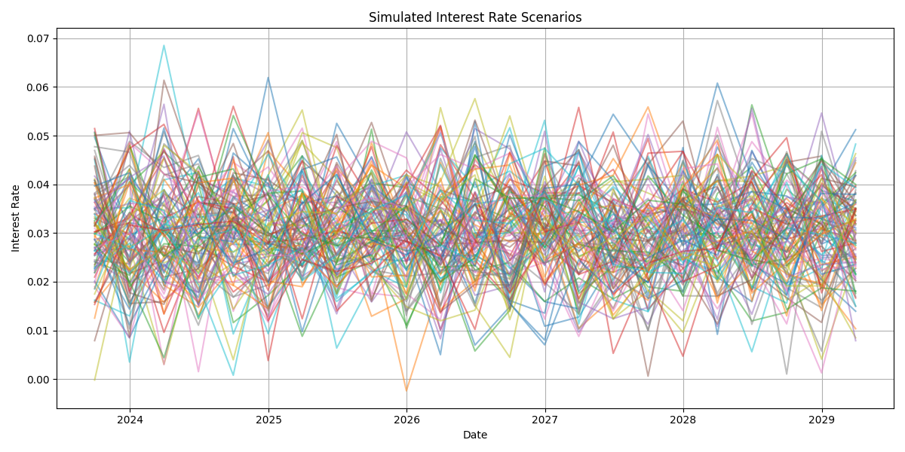
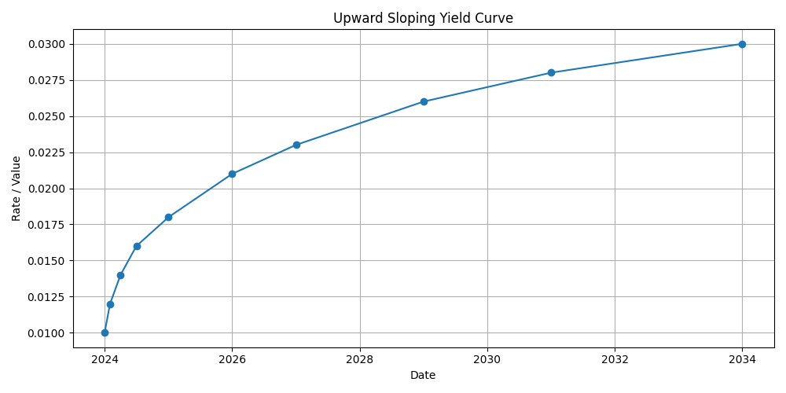
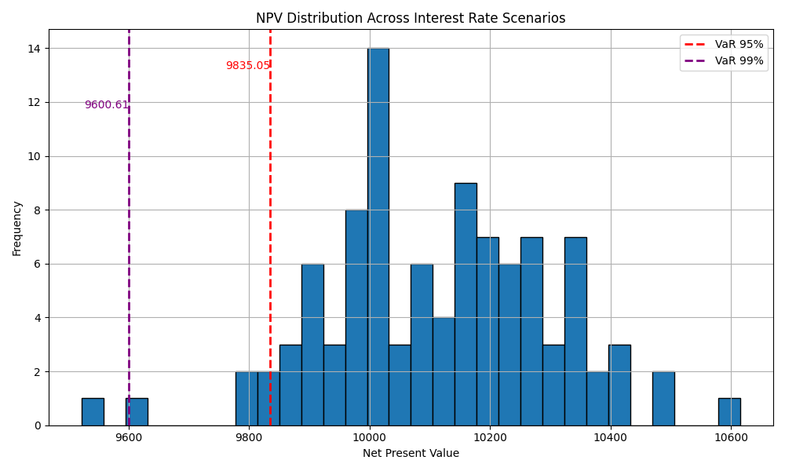

# Simulating Value-at-Risk (VaR) for a Single PAM Contract

This example illustrates how to simulate multiple interest rate scenarios and evaluate the Value-at-Risk (VaR) of a fixed-rate ACTUS PAM contract using the Awesome Actus Library (AAL).

> **Disclaimer:** This is a simplified, stylized example for educational purposes. It demonstrates simulation methodology and risk analysis but does not reflect actual market behavior or pricing standards.

---

## Step 0: Setup and imports
```python
import numpy as np
import pandas as pd
import matplotlib.pyplot as plt
from awesome_actus_lib import PAM, PublicActusService, ValueAnalysis, ReferenceIndex, YieldCurve
            
np.random.seed(42)
```

## Step 1: Define the Contract

We define a single fixed-rate Principal-at-Maturity (PAM) contract with annual interest payments and maturity in 2029.

```python
contract = PAM(
    contractID="PAM-01",
    statusDate="2025-12-30",
    contractDealDate="2023-12-31",
    currency="USD",
    notionalPrincipal=10000,
    initialExchangeDate="2024-01-01",
    maturityDate="2029-12-31",
    nominalInterestRate=0.05,
    cycleAnchorDateOfInterestPayment="2024-01-01",
    cycleOfInterestPayment="P1YL0",
    dayCountConvention="30E360",
    endOfMonthConvention="SD",
    premiumDiscountAtIED=0,
    contractRole="RPA",
    creatorID="Bank-01",
    counterpartyID="Counterparty-01",
    marketObjectCodeOfRateReset="IR_SCENARIO",
    rateSpread=0,
    cycleOfRateReset="P1YL0",
    cycleAnchorDateOfRateReset="2024-01-01",
)
```

---

## Step 2: Simulate Interest Rate Scenarios

We simulate 100 interest rate paths using a normal distribution centered at 3% with 1% volatility.

```python
n_scenarios = 100
scenarios = []
date_range = pd.date_range(start="2023-09-01", periods=23, freq="Q")

for _ in range(n_scenarios):
    simulated_rates = np.random.normal(loc=0.03, scale=0.01, size=len(date_range))
    df = pd.DataFrame({"date": date_range, "value": simulated_rates})
    scenario = ReferenceIndex(marketObjectCode="IR_SCENARIO", source=df, base=1.0)
    scenarios.append(scenario)

# Plot interest rate scenarios
plt.figure(figsize=(12, 6))
for scenario in scenarios:
    df = scenario._data.copy()
    plt.plot(pd.to_datetime(df["date"]), df["value"], alpha=0.5)
plt.title("Simulated Interest Rate Scenarios")
plt.xlabel("Date")
plt.ylabel("Interest Rate")
plt.grid(True)
plt.tight_layout()
plt.show()
```



---

## Step 3: Define the Yield Curve

The discounting is done using a upward-sloping yield curve.

```python

yield_curve = YieldCurve(
    marketObjectCode="DC_YC",
    referenceDate="2024-01-01",
    tenors=["0D", "1M", "3M", "6M", "1Y", "2Y", "3Y", "5Y", "7Y", "10Y"],
    rates=[0.01, 0.012, 0.014, 0.016, 0.018, 0.021, 0.023, 0.026, 0.028, 0.03]
)
yield_curve.plot()
```



---

## Step 4: Run Simulations and Compute NPVs

```python

service = PublicActusService()
npvs = []

for scen in scenarios:
    events = service.generateEvents(portfolio=contract, riskFactors=[scen, yield_curve])
    val = ValueAnalysis(events, as_of_date="2026-01-01", discount_curve_code="DC_YC")
    npvs.append(val.npv)
```

---

## Step 5: Plot NPV Distribution and Calculate Risk Measures

```python

var_95 = np.quantile(npvs, 0.05)
var_99 = np.quantile(npvs, 0.01)
initial = contract.terms.get("notionalPrincipal").value
breakeven_prob = sum(npv >= initial for npv in npvs) / len(npvs)

plt.figure(figsize=(10, 6))
plt.hist(npvs, bins=30, edgecolor="black")
plt.axvline(var_95, color='red', linestyle='--', linewidth=2, label='VaR 95%')
plt.axvline(var_99, color='purple', linestyle='--', linewidth=2, label='VaR 99%')
plt.text(var_95, plt.ylim()[1]*0.9, f'9835.05', color='red', ha='right')
plt.text(var_99, plt.ylim()[1]*0.8, f'9600.61', color='purple', ha='right')
plt.title("NPV Distribution Across Interest Rate Scenarios")
plt.xlabel("Net Present Value")
plt.ylabel("Frequency")
plt.legend()
plt.grid(True)
plt.tight_layout()
plt.show()

print(f"VaR 95%: {var_95}")
print(f"VaR 99%: {var_95}")
print(f"Break-even Probability (NPV ≥ 10000): {breakeven_prob}%")
```



**Results:**
- VaR 95%: 9835.05
- VaR 99%: 9600.61
- Break-even Probability (NPV ≥ 10000): 70.00%

