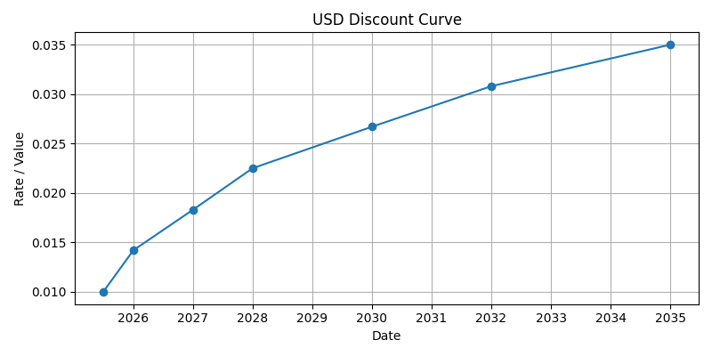

# Analysis Example: Multi-Contract Portfolio Analysis

This example demonstrates how to model, simulate, and analyze a portfolio of fixed-rate and floating-rate ACTUS contracts using the Awesome Actus Library (AAL).

## Step 0: Setup and Imports
We start by importing all required libraries, setting a random seed for reproducibility, and creating a folder to store plots.

```python
import numpy as np
import pandas as pd
from awesome_actus_lib import PAM, ANN, Portfolio, ReferenceIndex, YieldCurve, PublicActusService, LiquidityAnalysis, ValueAnalysis, IncomeAnalysis
np.random.seed(42) # for reproducability 
```

## Step 1: Define a Portfolio of Fixed and Floating Contracts
We create a portfolio consisting of:
- 5 fixed-rate Principal-at-Maturity (PAM) contracts
- 3 fixed-rate Annuity (ANN) contracts
- 2 floating-rate Annuity (ANN) contracts linked to a reference index

```python
contracts = []

# Fixed-rate PAM contracts
for i in range(5):
    contracts.append(PAM(
        contractID=f"pam{i+1}",
        contractRole="RPA",
        statusDate="2024-12-31",
        initialExchangeDate=f"2025-01-0{i+1}",
        maturityDate=f"2028-01-0{i+1}",
        notionalPrincipal=10000 + i * 1000,
        nominalInterestRate=0.02 + i * 0.002,
        dayCountConvention="30E360",
        currency="USD",
        contractDealDate="2024-12-31",
        counterpartyID="CP01",
        creatorID="Bank01",
        cycleOfInterestPayment=["P1YL1","P6ML1","P3ML1","P1YL1","P9ML1"][i],
    ))

# Fixed-rate ANN contracts
for i in range(3):
    contracts.append(ANN(
        contractID=f"ann{i+1}",
        contractRole="RPA",
        statusDate="2024-12-31",
        initialExchangeDate=f"2025-02-0{i+1}",
        maturityDate=f"2029-02-0{i+1}",
        notionalPrincipal=12000 + i * 1500,
        nominalInterestRate=0.025 + i * 0.0015,
        dayCountConvention="30E360",
        cycleOfInterestPayment="P1YL1",
        cycleOfPrincipalRedemption="P1YL1",
        cycleAnchorDateOfInterestPayment="2026-02-01",
        cycleAnchorDateOfPrincipalRedemption="2026-02-01",
        currency="USD",
        contractDealDate="2024-12-31",
        counterpartyID="CP01",
        creatorID="Bank01",
    ))

# Floating-rate ANN contracts
index_code = "US_Floating_6M"
for i in range(2):
    contracts.append(ANN(
        contractID=f"vann{i+1}",
        contractRole="RPA",
        statusDate="2024-12-31",
        initialExchangeDate=f"2025-03-0{i+1}",
        maturityDate=f"2029-03-0{i+1}",
        notionalPrincipal=15000 + i * 1000,
        nominalInterestRate=0.0,  # Overridden by reset
        dayCountConvention="30E360",
        cycleOfInterestPayment="P1YL1",
        cycleOfPrincipalRedemption="P1YL1",
        cycleAnchorDateOfInterestPayment="2026-03-01",
        cycleAnchorDateOfPrincipalRedemption="2026-03-01",
        cycleOfRateReset="P6ML1",
        marketObjectCodeOfRateReset=index_code,
        rateSpread=0.01,
        currency="USD",
        contractDealDate="2024-12-31",
        counterpartyID="CP02",
        creatorID="Bank01",
    ))

ptf = Portfolio(contracts)
```

## Step 2: Define Risk Factors
We define a discount curve and a reference index:
- The **discount curve** is used later for value and income analysis.
- The **reference index** drives the rate reset of the floating-rate contracts.

Note: We pass both risk factors to `generateEvents()` even though the discount curve is not used for event generation — this ensures it is included in the resulting `CashFlowStream` for later analyses. (An alternative would be to inject it into the `CashFlowStream` manually after generation.)

```python
tenors = ["6M", "1Y", "2Y", "3Y", "5Y", "7Y", "10Y"]
rates = [0.01, 0.015, 0.02, 0.023, 0.028, 0.032, 0.035]
discount_curve = YieldCurve(
    marketObjectCode="USD_DISCOUNT",
    referenceDate="2025-01-01",
    tenors=tenors,
    rates=rates,
    base=1.0
)
discount_curve.plot()

index_data = pd.DataFrame({
    "date": pd.date_range(start="2023-01-01", end="2030-12-31", periods=20).strftime("%Y-%m-%d"),
    "value": np.random.uniform(0.01, 0.04, size=20).round(4)
})
ref_index = ReferenceIndex(marketObjectCode=index_code, source=index_data, base=1.0)
ref_index.plot()
```




## Step 3: Generate Cash Flow Events
We simulate the full event schedule across all contracts:

```python
service = PublicActusService()
events = service.generateEvents(portfolio=ptf, riskFactors=[discount_curve, ref_index])
events.plot()
```


### Preview of Event Table (first 20 rows)
| type   | time             |   payoff | currency   |   nominalValue |   nominalRate |   nominalAccrued | contractId   |
|--------|------------------|----------|------------|----------------|---------------|------------------|--------------|
| IED    | 2025-01-01T00:00 |   -10000 | USD        |          10000 |         0.02  |                0 | pam1         |
| IP     | 2025-01-01T00:00 |        0 | USD        |          10000 |         0.02  |                0 | pam1         |
| IP     | 2026-01-01T00:00 |      200 | USD        |          10000 |         0.02  |                0 | pam1         |
| IP     | 2027-01-01T00:00 |      200 | USD        |          10000 |         0.02  |                0 | pam1         |
| IP     | 2028-01-01T00:00 |      200 | USD        |          10000 |         0.02  |                0 | pam1         |
| MD     | 2028-01-01T00:00 |    10000 | USD        |              0 |         0.02  |                0 | pam1         |
| IED    | 2025-01-02T00:00 |   -11000 | USD        |          11000 |         0.022 |                0 | pam2         |
| IP     | 2025-01-02T00:00 |        0 | USD        |          11000 |         0.022 |                0 | pam2         |
| IP     | 2025-07-02T00:00 |      121 | USD        |          11000 |         0.022 |                0 | pam2         |
| IP     | 2026-01-02T00:00 |      121 | USD        |          11000 |         0.022 |                0 | pam2         |
| IP     | 2026-07-02T00:00 |      121 | USD        |          11000 |         0.022 |                0 | pam2         |
| IP     | 2027-01-02T00:00 |      121 | USD        |          11000 |         0.022 |                0 | pam2         |
| IP     | 2027-07-02T00:00 |      121 | USD        |          11000 |         0.022 |                0 | pam2         |
| IP     | 2028-01-02T00:00 |      121 | USD        |          11000 |         0.022 |                0 | pam2         |
| MD     | 2028-01-02T00:00 |    11000 | USD        |              0 |         0.022 |                0 | pam2         |
| IED    | 2025-01-03T00:00 |   -12000 | USD        |          12000 |         0.024 |                0 | pam3         |
| IP     | 2025-01-03T00:00 |        0 | USD        |          12000 |         0.024 |                0 | pam3         |
| IP     | 2025-04-03T00:00 |       72 | USD        |          12000 |         0.024 |                0 | pam3         |
| IP     | 2025-07-03T00:00 |       72 | USD        |          12000 |         0.024 |                0 | pam3         |
| IP     | 2025-10-03T00:00 |       72 | USD        |          12000 |         0.024 |                0 | pam3         |

## Step 4: Liquidity Analysis
This shows net inflows and outflows aggregated per year. It is useful to assess funding needs or surpluses.

```python
liq = LiquidityAnalysis(cf_stream=events, freq="Y")
liq.plot()
```


```
       netLiquidity
time               
2025 -130869.000000
2026   18057.974013
2027   18335.536044
2028   78097.645896
2029   26657.859228
```

## Step 5: Value Analysis
We discount all future cash flows using the yield curve to compute present value as of `2025-01-01`.

```python
val = ValueAnalysis(cf_stream=events, as_of_date="2025-01-01", discount_curve_code="USD_DISCOUNT")
```

```
  as_of_date  nominal_value          npv
0 2025-01-01   10280.015181  1306.439457
```

## Step 6: Income Analysis
This breaks down recognized income over time, based on the contractual cash flows.

```python
inc = IncomeAnalysis(cf_stream=events, freq="Y")
inc.plot()
```


```
        netIncome
time             
2025   631.000000
2026  3154.658472
2027  3243.326902
2028  2460.038044
2029   790.991763
```
