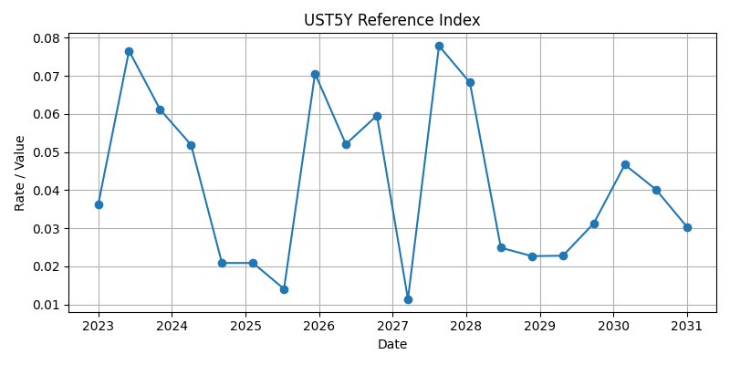
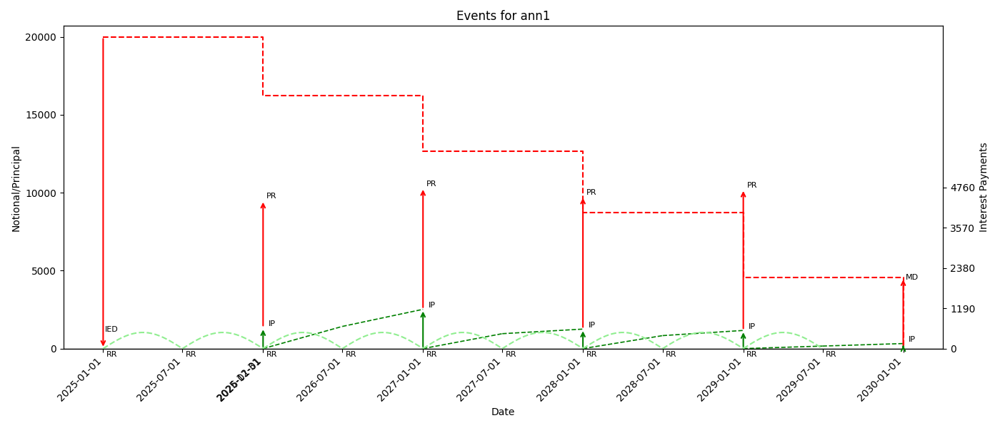
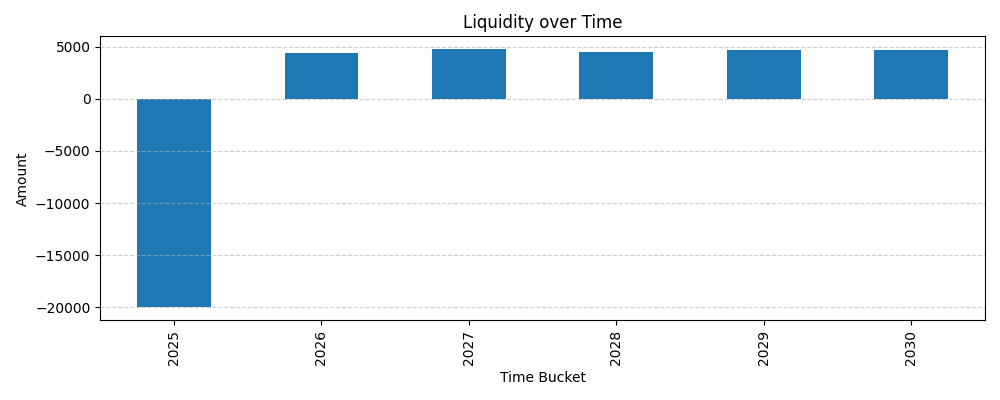
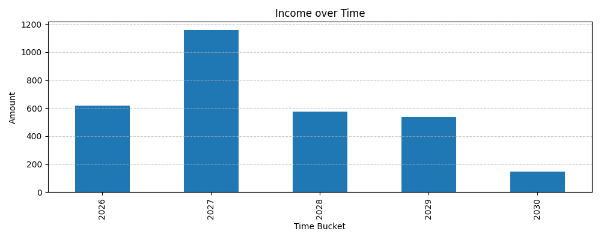

# Analysis Example: Variable Rate Annuity Contract

This end-to-end example demonstrates how to define, simulate, and analyze a **variable-rate Annuity (ANN)** contract using the Awesome Actus Library (AAL).

## 0. Setup and Imports
```python
import numpy as np
import pandas as pd
from awesome_actus_lib import ANN, ReferenceIndex, PublicActusService, LiquidityAnalysis, ValueAnalysis, IncomeAnalysis
np.random.seed(42) # for reproducability 
```

## 1. Define the Contract
We define an annuity contract that pays interest and principal annually and resets its rate every 6 months based on a reference index.

```python
ann = ANN(
    contractID="ann1",
    creatorID="me",
    counterpartyID="bank",
    notionalPrincipal=20000,
    nominalInterestRate=0.04,
    dayCountConvention="30E360",
    contractRole="RPA",
    statusDate="2024-12-31",
    initialExchangeDate="2025-01-01",
    maturityDate="2030-01-01",
    contractDealDate="2024-12-31",
    currency="USD",
    cycleOfInterestPayment="P1YL1",
    cycleOfPrincipalRedemption="P1YL1",
    cycleAnchorDateOfInterestPayment="2026-01-01",
    cycleAnchorDateOfPrincipalRedemption="2026-01-01",
    cycleOfRateReset="P6ML1",
    marketObjectCodeOfRateReset="UST5Y",
    rateSpread=0.01
)
```

## 2. Simulate Reference Index (UST5Y)
We generate a synthetic interest rate index (`UST5Y`) with 20 semiannual points from 2023 to 2030.

```python
index_data = pd.DataFrame({
    "date": pd.date_range(start="2023-01-01", end="2030-12-31", periods=20).strftime("%Y-%m-%d"),
    "value": np.random.uniform(0.01, 0.08, size=20).round(4)
})
ust5y = ReferenceIndex(marketObjectCode="UST5Y", source=index_data, base=1.0)
ust5y.plot()
```



## 3. Generate Cash Flow Events
Using the contract and index, we generate future cash flow events (principal, interest, etc.).

```python
service = PublicActusService()
events = service.generateEvents(portfolio=ann, riskFactors=ust5y)
events.plot()
```



### Event Table
| type   | time             |     payoff | currency   |   nominalValue |   nominalRate |   nominalAccrued | contractId   |
|--------|------------------|------------|------------|----------------|---------------|------------------|--------------|
| IED    | 2025-01-01T00:00 | -20000     | USD        |       20000    |        0.04   |           0      | ann1         |
| RR     | 2025-01-01T00:00 |      0     | USD        |       20000    |        0.0309 |           0      | ann1         |
| PRF    | 2025-01-01T00:00 |      0     | USD        |       20000    |        0.0309 |           0      | ann1         |
| RR     | 2025-07-01T00:00 |      0     | USD        |       20000    |        0.0309 |         309      | ann1         |
| PRF    | 2025-07-01T00:00 |      0     | USD        |       20000    |        0.0309 |         309      | ann1         |
| PRF    | 2025-12-31T00:00 |      0     | USD        |       20000    |        0.0309 |         616.283  | ann1         |
| PR     | 2026-01-01T00:00 |   3760.32  | USD        |       16239.7  |        0.0309 |         618      | ann1         |
| IP     | 2026-01-01T00:00 |    618     | USD        |       16239.7  |        0.0309 |           0      | ann1         |
| RR     | 2026-01-01T00:00 |      0     | USD        |       16239.7  |        0.0806 |           0      | ann1         |
| PRF    | 2026-01-01T00:00 |      0     | USD        |       16239.7  |        0.0806 |           0      | ann1         |
| RR     | 2026-07-01T00:00 |      0     | USD        |       16239.7  |        0.0621 |         654.459  | ann1         |
| PRF    | 2026-07-01T00:00 |      0     | USD        |       16239.7  |        0.0621 |         654.459  | ann1         |
| PR     | 2027-01-01T00:00 |   3591.5   | USD        |       12648.2  |        0.0621 |        1158.7    | ann1         |
| IP     | 2027-01-01T00:00 |   1158.7   | USD        |       12648.2  |        0.0621 |           0      | ann1         |
| RR     | 2027-01-01T00:00 |      0     | USD        |       12648.2  |        0.0696 |           0      | ann1         |
| PRF    | 2027-01-01T00:00 |      0     | USD        |       12648.2  |        0.0696 |           0      | ann1         |
| RR     | 2027-07-01T00:00 |      0     | USD        |       12648.2  |        0.0214 |         440.157  | ann1         |
| PRF    | 2027-07-01T00:00 |      0     | USD        |       12648.2  |        0.0214 |         440.157  | ann1         |
| PR     | 2028-01-01T00:00 |   3926.05  | USD        |        8722.12 |        0.0214 |         575.492  | ann1         |
| IP     | 2028-01-01T00:00 |    575.492 | USD        |        8722.12 |        0.0214 |           0      | ann1         |
| RR     | 2028-01-01T00:00 |      0     | USD        |        8722.12 |        0.0879 |           0      | ann1         |
| PRF    | 2028-01-01T00:00 |      0     | USD        |        8722.12 |        0.0879 |           0      | ann1         |
| RR     | 2028-07-01T00:00 |      0     | USD        |        8722.12 |        0.0349 |         383.337  | ann1         |
| PRF    | 2028-07-01T00:00 |      0     | USD        |        8722.12 |        0.0349 |         383.337  | ann1         |
| PR     | 2029-01-01T00:00 |   4172.68  | USD        |        4549.44 |        0.0349 |         535.538  | ann1         |
| IP     | 2029-01-01T00:00 |    535.538 | USD        |        4549.44 |        0.0349 |           0      | ann1         |
| RR     | 2029-01-01T00:00 |      0     | USD        |        4549.44 |        0.0327 |           0      | ann1         |
| PRF    | 2029-01-01T00:00 |      0     | USD        |        4549.44 |        0.0327 |           0      | ann1         |
| RR     | 2029-07-01T00:00 |      0     | USD        |        4549.44 |        0.0328 |          74.3834 | ann1         |
| PRF    | 2029-07-01T00:00 |      0     | USD        |        4549.44 |        0.0328 |          74.3834 | ann1         |
| IP     | 2030-01-01T00:00 |    148.994 | USD        |        4549.44 |        0.0328 |           0      | ann1         |
| MD     | 2030-01-01T00:00 |   4549.44  | USD        |           0    |        0.0328 |           0      | ann1         |

## 4. Liquidity Analysis
Yearly net cash flows are analyzed to identify funding needs or surpluses.

```python
liq = LiquidityAnalysis(cf_stream=events, freq="Y")
liq.plot()
```



```
      netLiquidity
time              
2025 -20000.000000
2026   4378.319824
2027   4750.203489
2028   4501.546054
2029   4708.218944
2030   4698.437641
```

## 5. Value Analysis
Discounted value of future cash flows as of `2025-01-01` using a 2% flat rate.

```python
val = ValueAnalysis(cf_stream=events, as_of_date="2025-01-01", flat_rate=0.02)
```

```
  as_of_date  nominal_value         npv
0 2025-01-01    3036.725952  296.344084
```

## 6. Income Analysis
Annual income flows based on the contract’s interest components.

```python
inc = IncomeAnalysis(cf_stream=events, freq="Y")
inc.plot()
```



```
        netIncome
time             
2026   618.000000
2027  1158.701181
2028   575.492093
2029   535.538408
2030   148.994270
```
