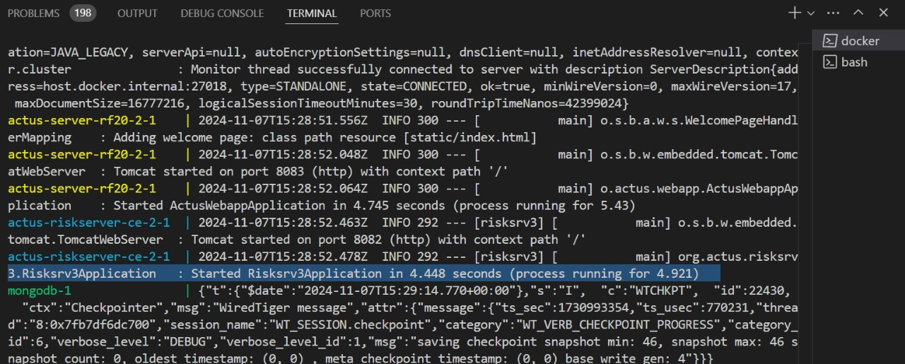

# ACTUS Quick Start 

##  GitHub Version

This guide provides a step-by-step approach to quickly set up and use the ACTUS framework using Docker.

## Prerequisites

Ensure the following conditions are met before beginning the installation:

- Docker Desktop is installed and running.
- The following ports are free and available:
  - **8083**: ACTUS service
  - **8082**: Risk service
  - **27018**: MongoDB

## Installation

Follow these steps to install and run ACTUS:

1. Clone the repository:
   ```bash
   git clone https://github.com/fnparr/docker-actus-rf20
2. Navigate to the directory where the repository was cloned.

3. Run the following command to start the Docker containers:
    ```bash
    docker compose -f config2-docker-actus-rf20.yml -p config2-docker-actus-rf20 up

4. Verify that the services are running by checking the logs for the following confirmation message:
    ```plaintext
    Risksrv3Application Started Risksrv3Application in X.XXX seconds



## Populating the Database
Populate the database with sample risk factor definitions for a US Treasury 5-Year Falling scenario.

1. Navigate to the test files directory:
    ```bash
    docker-actus-rf20/actus-riskserver-ce/actus-riskservice/testB
2. Run the command to populate the risk database:
    ```bash
    source putUst5Y_falling.txt
3. Verify successful execution by checking for this message:
    ```plaintext
    ReferenceIndex added Successfully
4. Confirm the database population by issuing a curl command:
    ```bash
    curl -v http://localhost:8082/findAllReferenceIndexes

This will display the reference data that has been created and saved.

## Running a Sample ACTUS Simulation

To execute an ACTUS simulation using the populated data:

1. Run the following command:
    ```plaintext
    source l3ANNwRF.txt

2. Upon successful execution, you should see this message:
    ```json
    "status": "Success"

## Completion

Congratulations! You have successfully:

1. Installed the ACTUS framework.

2. Populated the database with sample risk factors.

3. Run an ACTUS simulation.

Visit the [ACTUS GitHub Repository](https://github.com/fnparr/docker-actus-rf20) periodically for updates and additional resources.


