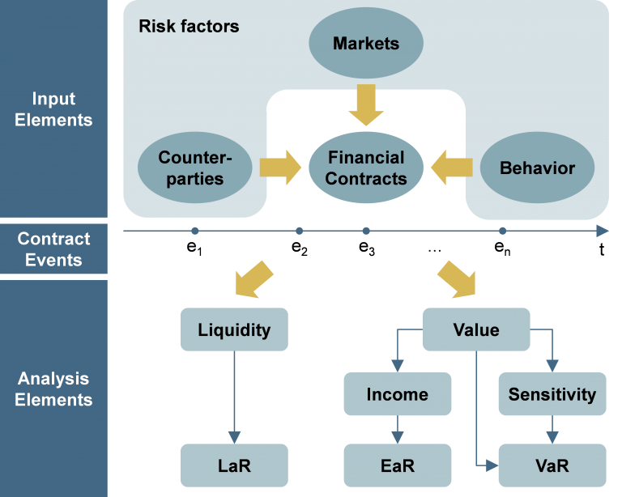

# Core Concepts of ACTUS

The ACTUS Standard is built around a set of core concepts that define how financial contracts are represented, interpreted, and simulated. These concepts are designed to ensure clarity, consistency, and automation in modeling financial instruments.

## 1. Contract Types (CTs)

**Contract Types** define the behavioral logic of financial contracts in terms of their **cash flow patterns**. A CT determines how payments such as interest, fees, and principal evolve over time based on given inputs.

The defining characteristic of a contract type is not its legal or market label, but its **cash flow generation logic**. This means that a wide variety of financial contracts—despite different names or purposes—can be represented using the same ACTUS contract type if they share the same underlying cash flow structure.

### Example:
- A **bullet loan**, a **term deposit**, and a **bond** can all be modeled using the **PAM (Principal at Maturity)** contract type, since they all involve a single principal repayment at maturity with periodic interest payments.

### Common CTs include:
- **PAM** – Principal at Maturity
- **ANN** – Annuity
- **LAM** – Linear Amortizer
- **SWPPV** – Plain Vanilla Swap
- **FXOUT** – Foreign Exchange Outright
- **OPTNS** – Options

Each CT provides a clear and formal definition of how cash flows are generated, making it a building block for automated and consistent financial modeling.

## 2. Contract Terms / Contract Attributes (CAs)

**Contract Attributes** define the parameters needed to instantiate a specific contract. These include values like interest rate, notional principal, maturity date, and frequency of payments.

Attributes can be:
- **Mandatory**: Must be defined for a valid contract.
- **Optional**: May be omitted, with defaults or implied logic applied.
- **Not Applicable**: Irrelevant for a specific contract type.

ACTUS includes a dictionary of all attributes and their properties (type, domain, default, applicability) see: [ACTUS Data Dictionary](https://www.actusfrf.org/dictionary).

### 2.1 Applicability Rules (Business Rules)

To enforce this logic, ACTUS defines business rules that govern the applicability of each attribute for a certain contract type. These rules are expressed in a compact syntax:

a(b,c,d)e

Where:
- `a`: Whether the attribute is mandatory (`NN`), optional (`x`), or not applicable (`[]`).
- `b`: Group number for logically related attributes.
- `c`: Dependency logic within the group (e.g., driver-dependent).
- `d`: Applicability to parent or child contract contexts.
- `e`: Special rules for specific contract logic (e.g., synchronizations or exceptions).

These rules dynamically determine which attributes are required or relevant depending on the **contract type**, the **structure of the contract** (e.g., parent/child relationships), and the **values of other attributes**.

> 🔎 **To correctly configure a contract**, it's essential to consult the detailed documentation for the specific contract type.
>
> In the [Contract Types Reference](../contract-types/PAM.md), each CT is described along with:
> - The list of applicable attributes
> - Their corresponding business rules
> - Special logic or dependencies

This ensures you only set the required and relevant terms when modeling contracts using ACTUS.

## 3. Risk Factors

**Risk factors** represent external economic variables that influence the cash flows of a financial contract. These include elements such as:

- Interest rates
- Market indexes
- FX rates
- Commodity prices
- Inflation rates

While contract terms define the static structure of a contract, **risk factors introduce dynamic behavior** based on economic conditions. They are not part of the contract itself but serve as **external inputs** during simulation.

### How Risk Factors Are Referenced

Within ACTUS, risk factors are linked to specific contract attributes through references using the `marketObjectCode`. This ensures clear mapping between a contract and the economic variable it depends on.

For example:
- A floating interest rate contract may use `marketObjectCodeOfRateReset` to reference a risk factor like LIBOR or EURIBOR.
- A scaling index or a rate spread can be tied to external market values through similar references.

Risk factors are modeled as **time series** or **scenario-based data**, enabling simulation of future contract behavior under various assumptions.

## 4. Modeling Methodology

ACTUS employs a **deterministic and stateful modeling paradigm** to simulate financial contracts and generate analytically useful outputs.

At the heart of this paradigm is a **strict separation of concerns**:

- **Contract Terms**: These are static. Once a contract is agreed, its legal definition does not change.
- **Risk Factors**: These are dynamic. They evolve over time and represent changing macroeconomic, market, and behavioral conditions.

This clean separation enables **reliable contract simulation** while supporting dynamic scenario analysis and stress testing.

### How It Works

1. **Input Elements**: 
   - Contract terms (structure and logic)
   - Risk factor paths (e.g. interest rates, FX rates)
   - Behavior and counterparty characteristics

2. **Simulation**:
   - ACTUS simulates time-based **contract events** (e.g. interest payments, redemptions).
   - Events update internal state (e.g. remaining principal, accrued interest).
   - Result is a **cash flow stream**: a sequence of timestamped financial events.

3. **Analysis**:
   - The generated event stream forms the basis for calculating metrics such as:
     - **Liquidity at Risk (LaR)**
     - **Earnings at Risk (EaR)**
     - **Value at Risk (VaR)**
     - Contractual **valuation**, **sensitivity**, and **income**
   - Because these outputs derive directly from discrete events, they are **auditable and transparent**.
   - This event-centric design allows drill-down to individual flows, enhancing explainability.

### ACTUS Modeling Paradigm

*Figure: ACTUS separates the known (contract structure) from the unknown (future risk factor paths). Events are simulated deterministically, and metrics are derived by aggregating these events.*

---

> To explore details of specific contract types or attributes, continue to:
>
> - [Contract Types Reference](../contract-types/PAM.md)
> - [Contract Terms Reference](../contract-terms/contract-terms-overview.md)
